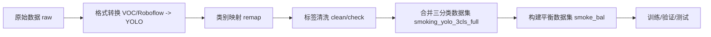
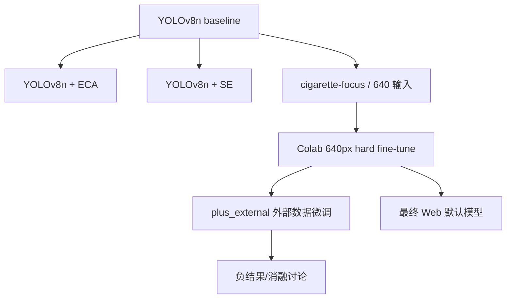
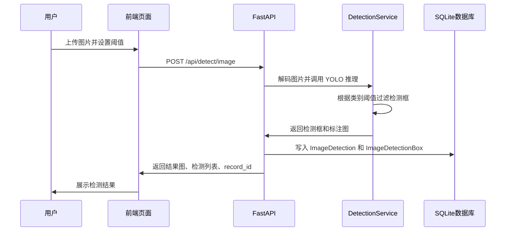
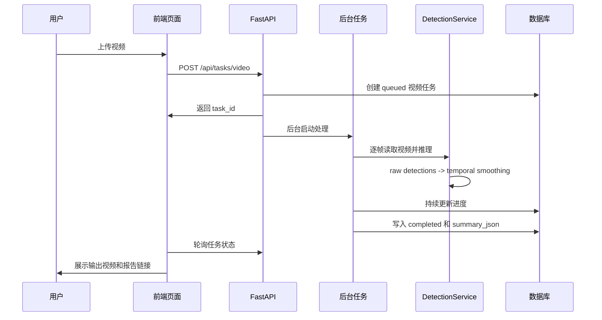
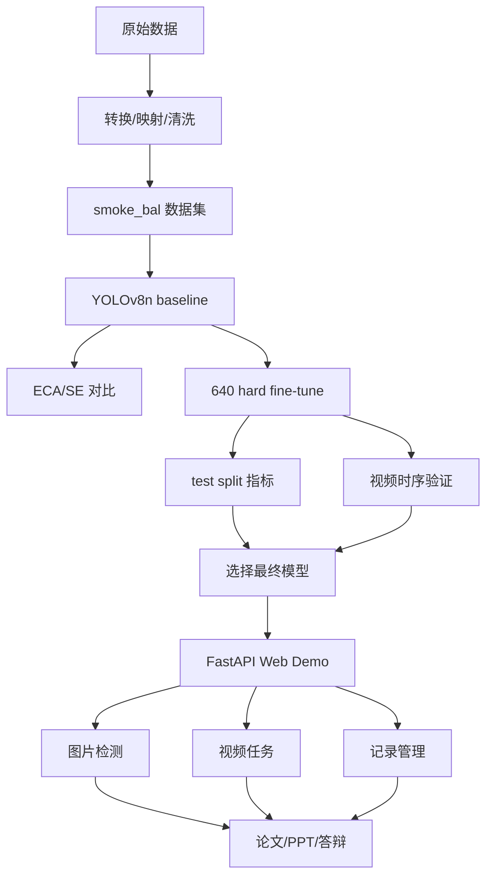

# 基于深度学习的吸烟行为检测系统：项目知识熟悉手册（答辩版）

> 生成日期：2026-05-06  
> 项目路径：`D:\Smoker Behavior Detection Based on Deep Learning`  
> 使用目的：答辩前从零熟悉项目。目标不是背代码，而是能把“为什么做、数据怎么来、模型怎么训、结果怎么解释、系统怎么演示、局限在哪里”讲得像自己完整做过。

---

## 0. 先记住整个项目的一句话

本项目不是简单做一个“吸烟/不吸烟分类器”，而是构建了一个基于 YOLOv8n 的三类吸烟相关目标检测系统，围绕 `cigarette`、`smoking_person`、`smoke` 三类目标完成数据集构建、模型训练对比、hard-case 微调、测试集评估、视频时序平滑和 FastAPI Web 演示系统。

答辩时最稳的核心表述：

> 本课题以吸烟行为场景为对象，将任务定义为三类目标检测：香烟、吸烟人员和烟雾。项目完成了多源数据整理、YOLO 格式转换、数据平衡、YOLOv8n 基线训练、ECA/SE 注意力机制对比、640 像素 hard-case 微调实验，并最终选择 YOLOv8n 640px hard fine-tune 模型作为系统默认模型。系统端实现了图片检测、视频异步检测、阈值调整、结果记录和视频时序平滑，用于毕业设计演示和实验分析。

---

## 1. 项目真正的核心是什么

### 1.1 技术核心

项目技术核心有四层：

| 层级 | 核心内容 | 你要会讲什么 |
|---|---|---|
| 数据层 | 多源吸烟相关图片数据清洗、类别映射、YOLO 标签构建、平衡数据集 `smoke_bal` | 数据从哪里来，为什么要清洗，三类标签是什么，为什么要平衡 |
| 模型层 | YOLOv8n 目标检测，baseline、ECA、SE、hard fine-tune、plus_external 对比 | 为什么用 YOLOv8n，为什么最终不是 ECA/SE，而是 hard fine-tune |
| 评估层 | Precision、Recall、mAP50、mAP50-95、分类别指标、视频时序指标 | 结果怎么读，为什么重点看 cigarette Recall |
| 系统层 | FastAPI Web Demo，图片检测、视频任务、数据库记录、阈值配置、时序平滑 | 系统怎么启动，上传后后端发生什么，视频为什么要异步和时序平滑 |

### 1.2 答辩最核心的结论

最终模型：

```text
YOLOv8n 640px Hard Fine-tune (20260502)
```

最终权重：

```text
D:\Smoker Behavior Detection Based on Deep Learning\runs\imported\yolov8n_colab_640_hard_candidate_20260502\train\weights\best.pt
```

最终主数据集：

```text
D:\Smoker Behavior Detection Based on Deep Learning\datasets\final\smoke_bal
```

最终系统入口：

```text
D:\Smoker Behavior Detection Based on Deep Learning\scripts\run_web_demo.py
```

最终 Web 默认参数：

```text
imgsz = 640
conf = 0.12
iou = 0.45
cigarette threshold = 0.12
smoking_person threshold = 0.22
smoke threshold = 0.28
stable_hits = 3
bridge_frames = 2
match_iou = 0.25
track_stale_frames = 5
```

一句话解释为什么选 hard 模型：

> hard fine-tune 模型虽然不是所有指标全面领先，但它提高了香烟小目标的召回率，并且在完整视频时序验证中表现更稳定，因此更符合本系统“尽量发现吸烟相关目标”的应用目标。

---

## 2. 项目目录怎么认识

你不用背每个文件，但必须知道每个目录的职责。

| 目录 | 作用 | 答辩时怎么说 |
|---|---|---|
| `configs/` | 数据集、训练、Web 演示配置 | 项目通过配置文件管理训练和演示参数，避免硬编码 |
| `datasets/raw/` | 原始数据 | 保存原始下载或采集的数据 |
| `datasets/interim/` | 中间处理数据 | 保存转换、映射、清洗后的中间数据 |
| `datasets/final/` | 最终训练数据 | 主要使用 `smoke_bal` 作为训练和评估数据 |
| `datasets/reports/` | 数据检查和统计报告 | 用于证明数据集结构和标签合法性 |
| `scripts/` | 数据处理、训练、验证、预测、导出、分析脚本 | 项目工程链路的主要入口 |
| `models/` | 自定义模型结构和注意力模块 | 保存 ECA、SE 对比实验所需结构 |
| `app/` | Web 和桌面系统代码 | FastAPI Web 演示系统主要在这里 |
| `runs/` | 训练、验证、预测和分析结果 | 保存模型权重、指标、曲线和报告 |
| `output/` | Web 运行产物、论文、PPT 等交付文件 | 答辩演示和文档交付都在这里 |
| `docs/` | 项目报告、结论、复习材料 | 答辩复习材料和项目总结 |

最重要的 10 个路径：

```text
configs/data_smoking_balanced.yaml
configs/train_yolov8n_colab_640_hard.yaml
configs/web_demo.json
datasets/final/smoke_bal
runs/imported/yolov8n_colab_640_hard_candidate_20260502/train/weights/best.pt
scripts/train.py
scripts/val.py
app/web_demo.py
app/utils/web_inference.py
output/ppt/吸烟行为检测系统_答辩PPT_初稿12页.pptx
```

---

## 3. 任务定义：本项目到底检测什么

### 3.1 不是二分类，而是目标检测

错误理解：

```text
输入一张图片，判断是否有人吸烟。
```

正确理解：

```text
输入图片或视频帧，检测其中吸烟相关目标的位置和类别。
```

项目输出不是一个简单的 yes/no，而是多个检测框：

```text
类别 + 置信度 + 框坐标
```

例如：

```text
cigarette 0.72 [x1, y1, x2, y2]
smoke 0.81 [x1, y1, x2, y2]
```

### 3.2 三个类别的含义

| 类别 id | 类别名 | 中文解释 | 检测难度 | 作用 |
|---:|---|---|---|---|
| 0 | `cigarette` | 香烟、雪茄等吸烟器物 | 最高 | 最直接的吸烟证据，也是重点优化类 |
| 1 | `smoking_person` | 正在吸烟或与吸烟行为相关的人 | 较高 | 行为主体证据，但容易受姿态和标注标准影响 |
| 2 | `smoke` | 可见烟雾 | 中等 | 辅助证据，面积通常更大，但边界模糊 |

### 3.3 为什么不只检测“人”

因为普通人不等于吸烟行为。吸烟行为需要证据组合：

```text
香烟 + 人体动作 + 烟雾 + 视频连续性
```

如果只检测人，会把大量普通人误判为吸烟人员；如果只检测烟雾，会受雾气、光照、背景干扰；如果只检测香烟，小目标又容易漏检。因此项目使用三类目标共同描述吸烟行为。

### 3.4 为什么香烟是重点

香烟的特点：

- 面积小，很多时候只有几十个像素甚至更少。
- 形状细长，容易和手指、笔、筷子、嘴部边缘混淆。
- 经常被手部、嘴部遮挡。
- 光照暗、视频压缩、运动模糊都会影响检测。
- 框稍微偏一点，IoU 就会大幅下降。

所以本项目最终选择模型时，不只看整体 mAP，还重点看：

```text
cigarette Recall
cigarette mAP50
视频时序稳定性
```

---

## 4. 数据集必须怎么讲

### 4.1 最终主数据集

最终主数据集是：

```text
datasets/final/smoke_bal
```

配置文件是：

```text
configs/data_smoking_balanced.yaml
```

配置内容含义：

```yaml
path: datasets/final/smoke_bal
train: images/train
val: images/val
test: images/test
names:
  0: cigarette
  1: smoking_person
  2: smoke
```

解释：

- `path`：数据集根目录。
- `train`：训练集图片路径。
- `val`：验证集图片路径。
- `test`：测试集图片路径。
- `names`：类别 id 到类别名称的映射。

### 4.2 数据集数量

最终 `smoke_bal` 数据集数量：

| split | 图片数 | 标签数 | 作用 |
|---|---:|---:|---|
| train | 14416 | 14416 | 训练模型参数 |
| val | 1895 | 1895 | 训练过程中验证、早停、观察泛化 |
| test | 1925 | 1925 | 最终模型测试，论文指标主要看这里 |

全局类别框数量：

| 类别 | 框数量 |
|---|---:|
| cigarette | 7021 |
| smoking_person | 10562 |
| smoke | 7041 |

你要能说：

> 最终数据集不是原始数据直接训练，而是经过类别映射、标签检查、数据划分和平衡处理后得到的 YOLO 格式三分类数据集。

### 4.3 YOLO 标签格式

每张图片对应一个同名 `.txt` 标签文件。

一行表示一个目标框：

```text
class_id x_center y_center width height
```

例如：

```text
0 0.512300 0.431200 0.045100 0.022800
```

含义：

- `0`：类别 id，这里是 `cigarette`。
- `x_center`：目标中心点横坐标，相对于图片宽度归一化到 0-1。
- `y_center`：目标中心点纵坐标，相对于图片高度归一化到 0-1。
- `width`：目标框宽度，相对于图片宽度归一化。
- `height`：目标框高度，相对于图片高度归一化。

为什么归一化：

> 不同图片分辨率不同，归一化后标签格式统一，训练时可以配合不同输入尺寸使用。

### 4.4 为什么要做 balanced 数据集

完整数据集 `smoking_yolo_3cls_full` 中 `smoking_person` 远多于其他类：

```text
cigarette:       7021
smoking_person: 25579
smoke:           7041
```

如果直接训练，模型容易偏向 `smoking_person`，对香烟和烟雾关注不足。

所以构建 `smoke_bal`：

```text
cigarette:       7021
smoking_person: 10562
smoke:           7041
```

不是完全平均，而是“温和平衡”：保留 cigarette 和 smoke 的关键样本，减少一部分只有 `smoking_person` 的样本。

答辩说法：

> 由于原始合并数据中 smoking_person 类别明显偏多，如果直接训练可能造成类别偏置。因此项目构建了一个较平衡的 `smoke_bal` 数据集，保留香烟和烟雾相关样本，同时下采样部分单一人员样本，使模型更加关注吸烟行为相关证据。

### 4.5 数据处理流程



关键脚本：

| 脚本 | 作用 |
|---|---|
| `scripts/convert_voc_to_yolo.py` | VOC 标注转 YOLO 标注 |
| `scripts/prepare_roboflow_smoking.py` | 早期 Roboflow 数据准备 |
| `scripts/prepare_added_datasets.py` | 额外数据集准备 |
| `scripts/remap_labels.py` | 类别 id 重映射 |
| `scripts/split_dataset.py` | 划分 train/val/test |
| `scripts/build_partial_final_dataset.py` | 构建中间三分类数据集 |
| `scripts/build_balanced_dataset.py` | 构建 `smoke_bal` 平衡数据集 |
| `scripts/check_dataset.py` | 检查图片和标签是否匹配、标签是否合法 |
| `scripts/audit_yolo_dataset.py` | 更深入的数据质量审计 |

### 4.6 外部 Roboflow 数据怎么处理

外部数据集：

```text
datasets/interim/roboflow_cigarette_smoke_detection_v4_yolo3cls
```

处理脚本：

```text
scripts/prepare_roboflow_cigarette_smoke_detection.py
```

类别映射：

| 原始类别 | 项目中处理方式 |
|---|---|
| source 0 `Cigar in hand` | 映射为 target 0 `cigarette` |
| source 1 `Cigar near mouth` | 映射为 target 0 `cigarette` |
| source 2 `cold breath vapor` | 丢弃 polygon 标注，作为负样本保留图片 |
| source 3 `sunlight` | 丢弃 polygon 标注，作为负样本保留图片 |

为什么外部数据没有成为最终方案：

> 外部数据只补充了香烟框和部分负样本，没有补充 smoking_person 和 smoke 的一致标注；同时外部数据的拍摄场景、标注风格和主数据集存在分布差异。实验结果显示 plus_external 低于 hard 模型，因此作为负结果和消融讨论保留，而不是最终模型。

plus_external 测试结果：

| 指标 | plus_external |
|---|---:|
| Precision | 0.536 |
| Recall | 0.622 |
| mAP50 | 0.518 |
| mAP50-95 | 0.319 |
| cigarette Precision | 0.424 |
| cigarette Recall | 0.636 |
| cigarette mAP50 | 0.438 |

结论：

> 外部数据不是越多越好，关键在于分布一致性和标签一致性。

---

## 5. YOLOv8n 模型必须怎么理解

### 5.1 YOLO 是什么

YOLO 全称是 You Only Look Once，是一种单阶段目标检测算法。

通俗解释：

> YOLO 会在一次前向传播中同时预测目标类别和目标框位置，因此速度较快，适合实时检测和 Web 演示。

和两阶段检测器相比：

| 类型 | 代表 | 特点 |
|---|---|---|
| 两阶段检测 | Faster R-CNN | 先生成候选区域，再分类回归，通常更慢 |
| 单阶段检测 | YOLO | 直接预测类别和框，速度更快 |

### 5.2 YOLOv8n 的 n 是什么

`YOLOv8n` 里的 `n` 是 nano，表示最小模型版本。

特点：参数量小、推理速度快、适合 CPU 或普通笔记本演示，但精度上限不如更大的 YOLOv8s/m/l/x。

为什么本项目用 YOLOv8n：

> 毕业设计系统需要在本地 Web 演示中运行，YOLOv8n 在速度、部署成本和检测效果之间比较平衡，适合作为轻量级吸烟行为检测原型。

### 5.3 YOLO 模型结构名词

| 名词 | 解释 | 在本项目中怎么讲 |
|---|---|---|
| Backbone | 主干网络，负责提取图像特征 | 从原图中提取边缘、纹理、形状、语义信息 |
| Neck | 特征融合层 | 融合不同尺度特征，兼顾小目标和大目标 |
| Head | 检测头 | 输出类别、置信度和检测框 |
| C2f | YOLOv8 中的特征提取模块 | 用较轻量结构提取和融合特征 |
| SPPF | 空间金字塔池化模块 | 扩大感受野，增强多尺度信息 |
| Detect | 最终检测层 | 输出三类目标框 |
| Feature Map | 特征图 | 神经网络中间层对图像的抽象表达 |
| Downsample | 下采样 | 降低空间分辨率，提取更高级特征 |
| Upsample | 上采样 | 放大特征图，与浅层特征融合 |
| Concat | 拼接 | 把不同层特征合并 |

### 5.4 为什么小目标难检测

小目标在下采样后信息容易丢失。

例如一根香烟在原图中只有 20 像素宽，经过多次下采样后，在深层特征图上可能只剩 1-2 个特征点。此时模型很难稳定判断它是不是香烟。

所以项目做了这些尝试：

- 使用 640 输入尺寸，提高小目标在输入图中的像素占比。
- 降低 cigarette 类别阈值，提高召回。
- hard-case 微调，让模型多见难样本。
- 视频时序平滑，用连续帧弥补单帧不稳定。
- 尝试 ECA/SE 注意力机制，但未作为最终模型。

---

## 6. 训练配置怎么理解

最终 hard 模型训练配置：

```text
configs/train_yolov8n_colab_640_hard.yaml
```

核心参数：

| 参数 | 当前值 | 含义 | 怎么解释 |
|---|---:|---|---|
| `model` | `weights_imported/best.pt` | 起点权重 | 从已有较好模型继续微调 |
| `data` | `configs/data_smoking_balanced_colab.yaml` | 数据配置 | Colab 环境中的数据路径 |
| `epochs` | 40 | 最大训练轮数 | 训练最多 40 轮，早停可能提前结束 |
| `imgsz` | 640 | 输入尺寸 | 提高小目标香烟可见性 |
| `batch` | 32 | 每批图片数 | GPU 上提高训练效率 |
| `optimizer` | AdamW | 优化器 | 带权重衰减的 Adam 变体，泛化更稳 |
| `lr0` | 0.0003 | 初始学习率 | 微调阶段学习率较小，避免破坏已有权重 |
| `patience` | 12 | 早停耐心 | 多轮无提升则停止训练 |
| `device` | 0 | GPU 编号 | Colab 使用 GPU 训练 |
| `cache` | disk | 缓存方式 | 提高数据读取速度 |
| `amp` | true | 混合精度 | 降低显存占用，提高速度 |
| `cos_lr` | true | 余弦学习率 | 训练后期平滑降低学习率 |
| `close_mosaic` | 10 | 最后 10 轮关闭 mosaic | 后期让模型接近真实图像分布 |
| `mosaic` | 0.55 | Mosaic 增强概率 | 增加目标组合和背景变化 |
| `copy_paste` | 0.05 | 复制粘贴增强 | 有助于增加目标出现形式 |
| `erasing` | 0.1 | 随机擦除 | 提升遮挡鲁棒性 |
| `fliplr` | 0.5 | 水平翻转 | 增加左右方向变化 |

### 6.1 Epoch 是什么

一个 epoch 表示模型完整看完一遍训练集。训练集有 14416 张图片，训练 40 epoch 意味着理论上模型会反复学习这些图片 40 遍。但数据增强会让每轮图像有所变化，并且 early stopping 可能提前停止。

### 6.2 Batch 是什么

batch 是每次送入模型训练的图片数量。`batch=32` 表示一次计算 32 张图片的损失，然后更新模型参数。batch 大梯度更稳定但占显存更高；batch 小显存压力小但梯度波动更大。

### 6.3 Learning Rate 是什么

学习率控制模型每次参数更新的步子大小。hard fine-tune 使用较小学习率，是因为它不是从零训练，而是在已有较好模型上继续微调。

### 6.4 Fine-tune 是什么

Fine-tune 是微调，不是从零开始学习，而是在已有模型基础上继续针对当前数据和难样本进行调整。本项目 hard fine-tune 的目标是提高香烟小目标召回和视频稳定性。

### 6.5 Hard-case 是什么

Hard-case 指难样本，包括香烟很小、被遮挡、光照暗、视频模糊、和手指/嘴部相似、烟雾边界模糊等情况。

---

## 7. 模型实验路线



### 7.1 baseline 是什么

baseline 是基线模型。本项目 baseline 是 `YOLOv8n + smoke_bal 数据集`，作用是给后续改进提供对照。

baseline 测试结果：

| 指标 | 数值 |
|---|---:|
| Precision | 0.526 |
| Recall | 0.625 |
| mAP50 | 0.520 |
| mAP50-95 | 0.323 |
| cigarette Recall | 0.640 |
| cigarette mAP50 | 0.321 |

### 7.2 ECA 是什么

ECA 全称 Efficient Channel Attention，高效通道注意力。核心思想是学习不同通道的重要程度，让模型更关注有用特征，抑制无关特征。

本项目文件：

```text
models/modules/eca.py
models/yolov8n_eca.yaml
configs/train_yolov8n_eca_balanced.yaml
```

ECA 实验结果：

| 指标 | baseline | ECA |
|---|---:|---:|
| Precision | 0.526 | 0.511 |
| Recall | 0.625 | 0.597 |
| mAP50 | 0.520 | 0.489 |
| mAP50-95 | 0.323 | 0.294 |
| cigarette Recall | 0.640 | 0.620 |
| cigarette mAP50 | 0.321 | 0.270 |

结论：ECA 在本项目当前集成方式下没有提升效果，反而降低了性能。因此它作为对比实验和负结果分析，不作为最终模型。

### 7.3 SE 是什么

SE 全称 Squeeze-and-Excitation。核心思想是先压缩空间信息得到通道描述，再学习通道权重，最后重新标定特征通道。

本项目文件：

```text
models/modules/se.py
models/yolov8n_se.yaml
configs/train_yolov8n_se_balanced.yaml
```

SE 在本项目中效果也不理想，主要作为注意力机制对比实验。

### 7.4 为什么注意力机制没有成为最终模型

不能说“注意力没用”。正确说法：

> 注意力机制的效果依赖插入位置、模型容量、训练策略和数据质量。本项目中 ECA/SE 插入在 neck 特征融合点之后，更多是对已经融合后的通道做加权，未能有效恢复小目标香烟在早期下采样中丢失的空间信息。同时 YOLOv8n 模型容量较小，新增模块在有限训练预算下没有充分发挥作用，因此实验结果不如 baseline 和 hard fine-tune。

### 7.5 模型蒸馏是什么

模型蒸馏是让小模型学习大模型或教师模型的输出。

| 名词 | 含义 |
|---|---|
| Teacher | 教师模型，通常更强，用来产生软标签或伪标签 |
| Student | 学生模型，通常更轻量，学习教师模型能力 |
| Pseudo Label | 伪标签，由模型预测生成，不是人工标注 |
| Distillation | 蒸馏，让学生模型学习教师输出分布或伪标签 |

本项目有蒸馏相关脚本，但不是最终主线：

```text
scripts/export_teacher_targets.py
scripts/build_distillation_dataset.py
scripts/train_distilled_student.py
```

答辩时可以说：蒸馏作为后续优化方向保留，最终交付采用 hard fine-tune 模型。

---

## 8. 最终模型结果怎么讲

最终模型：`YOLOv8n 640px hard fine-tune`

测试集整体指标：

| 指标 | 数值 |
|---|---:|
| Precision | 0.5405 |
| Recall | 0.6900 |
| mAP50 | 0.5604 |
| mAP50-95 | 0.3559 |

分类别指标：

| 类别 | Precision | Recall | mAP50 | mAP50-95 |
|---|---:|---:|---:|---:|
| cigarette | 0.4456 | 0.7472 | 0.4967 | 0.2989 |
| smoking_person | 0.4331 | 0.5969 | 0.3962 | 0.2494 |
| smoke | 0.7429 | 0.7258 | 0.7883 | 0.5195 |

重点讲法：

> smoke 类别效果最好，mAP50 达到 0.7883；cigarette 是难度最高的小目标类别，但 Recall 达到 0.7472，说明模型能检出较多真实香烟目标；smoking_person 受人体姿态、标注标准和行为定义影响，指标相对较低。

### 8.1 和旧冠军模型对比

| 指标 | hard_finetune | old_champion | hard - old |
|---|---:|---:|---:|
| Precision | 0.5405 | 0.5387 | +0.0018 |
| Recall | 0.6900 | 0.6859 | +0.0041 |
| mAP50 | 0.5604 | 0.5613 | -0.0009 |
| mAP50-95 | 0.3559 | 0.3597 | -0.0038 |
| cigarette Recall | 0.7472 | 0.7212 | +0.0260 |
| cigarette mAP50 | 0.4967 | 0.4920 | +0.0048 |

客观结论：hard_finetune 并不是所有指标全面领先。它的 mAP50 和 mAP50-95 略低于 old_champion，但整体 Recall 和 cigarette Recall 更高。由于本项目更关注吸烟相关目标的发现能力，尤其是香烟小目标召回，所以最终选择 hard_finetune 作为默认模型。

---

## 9. 指标名词完整解释

| 名词 | 中文 | 含义 | 项目例子 |
|---|---|---|---|
| TP | 真阳性 | 真实有目标，模型也检测对了 | 图片里有香烟，模型框出了香烟 |
| FP | 假阳性/误检 | 真实没有目标，模型却检测出来了 | 把手指误检成香烟 |
| FN | 假阴性/漏检 | 真实有目标，模型没检测到 | 图片里有香烟，但模型没框出来 |
| Precision | 精确率 | 预测出来的框有多少是真的 | 反映误检多少 |
| Recall | 召回率 | 真实目标中有多少被找出来 | 反映漏检多少 |
| IoU | 交并比 | 预测框和真实框重叠程度 | 判断框准不准 |
| mAP50 | IoU=0.5 下的 mAP | 相对宽松，衡量是否基本检测到 | 小目标项目常看 |
| mAP50-95 | 多个 IoU 阈值平均 mAP | 更严格，衡量定位质量 | 通常低于 mAP50 |
| Conf | 置信度 | 模型对某个检测框的把握 | 阈值低召回高，阈值高误检少 |
| NMS | 非极大值抑制 | 去掉重复重叠框 | 保留同一目标最高置信度框 |

公式：

```text
Precision = TP / (TP + FP)
Recall = TP / (TP + FN)
IoU = 预测框和真实框交集面积 / 并集面积
```

---

## 10. Web 系统怎么理解

### 10.1 Web 系统技术栈

| 技术 | 作用 |
|---|---|
| FastAPI | 后端 Web 框架，提供页面和 API 接口 |
| Jinja2 | HTML 模板渲染 |
| JavaScript | 前端交互，上传文件、刷新记录、轮询视频任务 |
| SQLAlchemy | 数据库 ORM，管理表结构和查询 |
| SQLite | 默认本地数据库，适合答辩演示 |
| PostgreSQL | 可选数据库，适合更正式部署 |
| OpenCV | 图片解码、视频读取、绘制检测框、视频写出 |
| Ultralytics YOLO | 模型加载和推理 |
| ffmpeg / imageio-ffmpeg | 视频转码，保证浏览器可播放 |

### 10.2 启动命令

```powershell
cd "D:\Smoker Behavior Detection Based on Deep Learning"
Remove-Item Env:SMOKER_DB_URL -ErrorAction SilentlyContinue
& ".\.venv\Scripts\python.exe" scripts\run_web_demo.py --reload
```

访问：`http://127.0.0.1:8000`  
健康检查：`http://127.0.0.1:8000/api/health`

### 10.3 Web 后端核心文件

| 文件 | 作用 |
|---|---|
| `app/web_demo.py` | FastAPI 路由、图片检测接口、视频任务接口、记录接口 |
| `app/utils/web_inference.py` | 模型加载、图片推理、视频推理、阈值过滤、时序平滑 |
| `app/db_models.py` | 数据库表结构 |
| `app/db.py` | 数据库连接、初始化、默认设置 |
| `app/config.py` | 运行目录、数据库 URL、上传/结果目录 |
| `app/ui/templates/index.html` | 首页模板 |
| `app/ui/templates/video_report.html` | 视频报告页面模板 |
| `app/ui/static/js/app.js` | 前端上传、轮询、记录交互 |
| `app/ui/static/css/site.css` | 页面样式 |

### 10.4 Web 主要 API

| API | 方法 | 作用 |
|---|---|---|
| `/` | GET | 打开 Web 首页 |
| `/api/health` | GET | 检查模型、权重、数据库状态 |
| `/api/dashboard` | GET | 获取首页总览数据 |
| `/api/model` | GET | 查看当前运行模型 |
| `/api/models` | GET | 列出可用模型 |
| `/api/models/default` | POST | 切换默认模型 |
| `/api/settings` | GET/PUT | 查看或更新默认 conf、IoU、imgsz 等 |
| `/api/detect/image` | POST | 上传图片并检测 |
| `/api/records` | GET | 查看图片检测记录 |
| `/api/records/{id}` | GET | 查看单条检测详情 |
| `/api/records/{id}` | DELETE | 删除检测记录 |
| `/api/tasks/video` | POST | 创建视频检测任务 |
| `/api/tasks/video` | GET | 查看视频任务列表 |
| `/api/tasks/video/{id}` | GET | 查看视频任务详情 |
| `/reports/video/{id}` | GET | 查看视频检测报告页面 |

### 10.5 数据库表

| 表/模型 | 作用 |
|---|---|
| `ModelRegistry` | 保存可用模型名称、权重路径、说明 |
| `AppSetting` | 保存默认模型、conf、IoU、imgsz、上传大小限制 |
| `ImageDetection` | 保存图片检测记录 |
| `ImageDetectionBox` | 保存每张图片里的检测框 |
| `VideoTask` | 保存视频异步任务、进度、输出路径、统计摘要 |

### 10.6 图片检测流程



### 10.7 视频检测流程



### 10.8 视频时序平滑怎么讲

| 参数 | 当前值 | 含义 |
|---|---:|---|
| `match_iou` | 0.25 | 相邻帧检测框 IoU 超过该值，认为可能是同一目标 |
| `stable_hits` | 3 | 连续命中 3 帧后认为是稳定轨迹 |
| `bridge_frames` | 2 | 稳定目标短暂漏检 2 帧以内允许补帧 |
| `track_stale_frames` | 5 | 轨迹超过 5 帧未匹配则删除 |
| `CONFIDENCE_SMOOTH_ALPHA` | 0.7 | 平滑置信度，减少跳动 |

答辩讲法：

> 视频模块不是简单把图片检测重复到每一帧，而是加入了基于 IoU 的轨迹关联和时序平滑。只有目标连续命中达到一定次数后才显示为稳定目标，并允许短暂遮挡补帧，从而减少检测框闪烁，使结果更接近视频事件判断。

---

## 11. 系统演示流程

### 11.1 总览页看什么

1. 当前默认模型是 hard fine-tune。
2. 数据集是 `smoke_bal`，三类目标。
3. 显示推荐运行参数和实验指标。
4. 显示最近检测记录和视频任务。

### 11.2 图片怎么测

1. 打开 Web 首页。
2. 选择一张含吸烟目标的图片。
3. 保持默认 `conf=0.12`、`IoU=0.45`。
4. 点击上传检测。
5. 看标注图、检测框列表、类别和置信度。
6. 切到记录管理，看刚才的检测记录。

### 11.3 视频任务怎么讲

1. 上传一段短视频。
2. 系统创建视频任务。
3. 前端显示任务状态：queued/running/completed。
4. 等待完成后打开结果视频。
5. 打开视频报告页面。
6. 讲 raw、smoothed、stable track 等统计字段。

### 11.4 记录管理怎么演示

记录管理要讲：检测记录不是临时显示，而是持久化保存；每条图片记录有原图、结果图、模型、阈值、检测框数量；每条视频任务有状态、进度、输出路径和 summary。

---

## 12. 论文和 PPT 应该怎么突出项目

论文主线：

```text
任务背景 -> 三类目标检测定义 -> 数据集构建 -> YOLOv8n 基线 -> 注意力机制对比 -> hard fine-tune 最终模型 -> plus_external 负结果 -> Web 系统实现 -> 视频时序平滑 -> 结果分析和局限
```

PPT 十二页结构：

1. 题目页
2. 研究背景
3. 任务定义：三类目标
4. 数据集构建：`smoke_bal`
5. 模型设计：YOLOv8n + ECA/SE
6. 训练方案：baseline → hard fine-tune
7. 结果对比：为什么选 hard
8. 结果分析：香烟小目标瓶颈
9. 最终模型：YOLOv8n 640px hard fine-tune
10. 系统设计：Web 原型
11. 系统展示：图片检测、视频任务、记录管理
12. 总结与展望

---

## 13. 常见答辩问题和标准回答

### Q1：你的项目是分类还是检测？

> 是目标检测，不是简单分类。系统不仅判断图像中是否存在吸烟行为，还会输出吸烟相关目标的类别、位置和置信度。检测类别包括 cigarette、smoking_person 和 smoke。

### Q2：为什么选择 YOLOv8n？

> YOLOv8n 是轻量级目标检测模型，推理速度快、部署成本低，适合本地 Web 演示和毕业设计原型。相比更大的模型，YOLOv8n 在精度和实时性之间更平衡。

### Q3：为什么最终模型不是 ECA 或 SE？

> 本项目尝试了 ECA 和 SE 通道注意力机制，但测试结果没有提升。原因主要是当前插入位置在特征融合之后，对香烟这种小目标早期空间信息丢失帮助有限；同时 YOLOv8n 模型容量较小，新增模块在有限训练预算下没有充分发挥。因此最终采用表现更稳定的 hard fine-tune 模型。

### Q4：你的最终模型好在哪里？

> 最终 hard fine-tune 模型在测试集上整体 Recall 为 0.6900，香烟类别 Recall 为 0.7472，相比旧模型提高了香烟召回，更符合吸烟行为检测中减少漏检的需求。同时在完整视频时序验证中稳定轨迹数量和命中帧表现更好，因此作为 Web 默认模型。

### Q5：为什么不选 mAP50-95 更高的 old_champion？

> old_champion 的 mAP50-95 略高，说明它在严格定位指标上稍有优势。但本项目应用更关注吸烟相关目标的发现能力，尤其是香烟小目标召回。hard 模型的 cigarette Recall 更高，而且视频时序验证更稳定，所以最终选择 hard 模型。论文中也会客观说明它不是所有指标全面领先。

### Q6：plus_external 为什么失败？

> 外部数据并不一定带来提升。该外部数据主要补充香烟框和负样本，缺少与主数据一致的 smoking_person 和 smoke 标注；同时拍摄场景和标注风格存在分布差异。实验结果显示 plus_external 指标低于 hard 模型，因此作为负结果和消融分析。

### Q7：视频检测和图片检测有什么不同？

> 图片检测是单次推理，视频检测需要逐帧处理。如果只逐帧检测，结果容易闪烁。因此系统加入了时序平滑，通过相邻帧 IoU 关联目标，连续命中后形成稳定轨迹，并允许短时补帧，减少视频检测框抖动。

### Q8：系统为什么用异步视频任务？

> 视频检测耗时较长，如果同步处理会阻塞页面。异步任务可以先保存任务并返回任务编号，后台逐帧处理，前端轮询进度，用户可以看到任务状态和最终结果。

### Q9：数据库保存了什么？

> 数据库保存模型注册信息、系统默认参数、图片检测记录、图片检测框、视频任务记录和视频检测 summary。这样可以追溯每次检测使用的模型、阈值和输出结果。

### Q10：项目局限是什么？

> 第一，香烟是小目标，低清晰度和遮挡场景仍然容易漏检；第二，smoking_person 类别受人体姿态和标注标准影响，稳定性不如 smoke；第三，视频时序验证主要基于正样本视频，负样本误检验证还不充分；第四，系统目前适合毕业设计演示和研究原型，还不是生产级系统。

---

## 14. 不能说的话

| 不要说 | 应该说 |
|---|---|
| 模型准确率达到 90% | 最终模型在测试集上 Precision 为 0.5405，Recall 为 0.6900，mAP50 为 0.5604 |
| ECA/SE 没用 | ECA/SE 在本项目当前集成方式和训练条件下没有带来提升 |
| hard 模型所有指标都最好 | hard 模型在整体 Recall 和 cigarette Recall 上更适合本项目，但 mAP50-95 略低于 old_champion |
| 外部数据越多越好 | 外部数据是否有效取决于数据分布和标签一致性 |
| 系统已经可以生产部署 | 系统已经形成可运行的毕业设计演示和研究原型，但还不是生产级产品 |

---

## 15. 五天复习路线

### 第一天：数据和任务

掌握三类目标、`smoke_bal` 数据集、train/val/test 数量、YOLO 标签格式、为什么要平衡数据集。

### 第二天：模型和训练

掌握 YOLOv8n 为什么合适，baseline、ECA、SE、hard、plus_external 分别是什么，hard fine-tune 为什么是最终模型。

### 第三天：指标和结果

掌握 Precision、Recall、mAP50、mAP50-95，最终模型整体指标，`cigarette Recall = 0.7472`。

### 第四天：Web 系统

掌握启动命令、图片检测流程、视频异步任务流程、数据库记录保存什么、时序平滑怎么工作。

### 第五天：答辩串讲

12 页 PPT 每页讲 40-60 秒；面对负结果不慌；能承认局限但说明项目完整性。

---

## 16. 三分钟项目总讲稿

> 我的毕业设计题目是基于深度学习的吸烟行为检测系统。项目没有把吸烟识别简单定义为二分类，而是采用目标检测方式，对香烟、吸烟人员和烟雾三类吸烟相关目标进行检测。  
> 在数据方面，我对多源数据进行了格式转换、类别映射、标签清洗和数据集划分，最终形成 YOLO 格式的 `smoke_bal` 数据集，其中训练集 14416 张，验证集 1895 张，测试集 1925 张，类别包括 cigarette、smoking_person 和 smoke。由于原始数据中 smoking_person 类别偏多，我构建了较平衡的数据集，以减少类别偏置。  
> 在模型方面，我以 YOLOv8n 为基线，因为它参数量小、推理速度快，适合本地 Web 演示。实验中对比了 YOLOv8n baseline、ECA 注意力模型、SE 注意力模型、640 像素 hard-case 微调模型以及外部数据微调模型。结果表明，ECA 和 SE 在当前集成方式下没有提升，plus_external 外部数据也因为数据分布和标签一致性问题没有优于 hard 模型。最终采用 YOLOv8n 640px hard fine-tune 作为系统默认模型。  
> 最终模型在测试集上的 Precision 为 0.5405，Recall 为 0.6900，mAP50 为 0.5604，mAP50-95 为 0.3559。其中香烟类别 Recall 达到 0.7472。由于香烟是最重要也最难检测的小目标，因此我选择更偏向香烟召回和视频稳定性的 hard 模型作为最终模型。  
> 在系统方面，我实现了基于 FastAPI 的 Web 演示系统，支持图片上传检测、视频异步检测、阈值调整、模型切换和检测记录管理。视频检测中加入了基于 IoU 的时序平滑机制，通过连续命中、短时补帧和稳定轨迹判断减少检测框闪烁，使系统更适合视频吸烟行为演示。  
> 当前系统定位是毕业设计演示和研究型原型，已经打通了数据、训练、评估和 Web 展示链路，但仍存在小目标香烟定位困难、负样本视频误检验证不足等局限，后续可以继续补充非吸烟视频测试和高质量 hard-case 标注。

---

## 17. 最后必须背下来的数字

```text
最终数据集：datasets/final/smoke_bal
train images: 14416
val images: 1895
test images: 1925

类别：
0 cigarette
1 smoking_person
2 smoke

类别框数量：
cigarette: 7021
smoking_person: 10562
smoke: 7041

最终模型：YOLOv8n 640px Hard Fine-tune
最终权重：runs/imported/yolov8n_colab_640_hard_candidate_20260502/train/weights/best.pt

最终测试指标：
Precision: 0.5405
Recall: 0.6900
mAP50: 0.5604
mAP50-95: 0.3559

cigarette:
Precision: 0.4456
Recall: 0.7472
mAP50: 0.4967
mAP50-95: 0.2989

Web 参数：
conf: 0.12
iou: 0.45
imgsz: 640
cigarette threshold: 0.12
smoking_person threshold: 0.22
smoke threshold: 0.28
stable_hits: 3
bridge_frames: 2
match_iou: 0.25
```

---

## 18. 复习验收题

1. 你的项目为什么不是二分类？
2. 三个检测类别分别是什么？
3. `smoke_bal` 数据集怎么来的？
4. YOLO 标签每一行是什么意思？
5. 为什么要平衡数据集？
6. 为什么用 YOLOv8n？
7. Backbone、Neck、Head 分别是什么？
8. Precision 和 Recall 区别是什么？
9. mAP50 和 mAP50-95 区别是什么？
10. 为什么香烟比烟雾难检测？
11. baseline、ECA、SE、hard fine-tune 分别是什么？
12. 为什么 ECA/SE 没有成为最终模型？
13. 为什么 plus_external 是负结果？
14. 最终模型的 cigarette Recall 是多少？
15. hard 模型是不是所有指标都最好？如果不是，为什么还选它？
16. Web 系统启动命令是什么？
17. 图片上传后后端做了什么？
18. 视频为什么要异步任务？
19. 时序平滑的 `stable_hits=3` 是什么意思？
20. 数据库保存了哪些记录？
21. 答辩演示时总览页应该讲什么？
22. 你项目最大的局限是什么？
23. 后续怎么改进？

---

## 19. 最终提醒

答辩时你的姿态要稳：

- 讲清楚项目主线，不要陷入零散代码细节。
- 指标要客观，不夸大。
- 负结果要主动解释，体现你做过对比实验。
- 最终模型选择要围绕“香烟召回”和“视频稳定性”。
- Web 演示要提前固定素材，避免现场随机上传不可控样本。
- 系统定位是毕业设计演示和研究原型，不是生产级产品。

最重要的一句话：

> 这个项目的亮点不是某一个指标特别高，而是完成了从数据处理、模型对比、最终模型选择到 Web 图片/视频检测演示的完整工程闭环，并且对小目标香烟检测和视频时序稳定性做了针对性分析。


---

## 20. 深挖项目代码后的关键细节

这一部分是对项目代码再次检查后补充的。目的不是让你背源码，而是让你能在老师追问“你具体怎么做的”时，有实现细节可以讲。

### 20.1 数据平衡不是简单随机删数据

关键文件：

```text
scripts/build_balanced_dataset.py
```

这个脚本的核心不是“随机抽一部分数据”，而是先区分两类样本：

1. priority 样本：包含 `cigarette` 或 `smoke` 的图片。
2. optional 样本：只包含 `smoking_person` 的图片。

核心代码逻辑：

```python
def split_priority_and_optional(records):
    priority = []
    optional = []
    for record in records:
        has_minority = record.class_counts.get("0", 0) > 0 or record.class_counts.get("2", 0) > 0
        if has_minority:
            priority.append(record)
        elif record.class_counts.get("1", 0) > 0:
            optional.append(record)
    return priority, optional
```

这段代码说明：

- 只要图片里有香烟 `0` 或烟雾 `2`，就优先保留。
- 只有 `smoking_person` 的图片才进入可选下采样池。
- 这样做的目的是避免把项目最关心的香烟和烟雾样本删掉。

答辩说法：

> 平衡数据集时，我没有简单随机删除样本，而是优先保留包含 cigarette 和 smoke 的图片，只对 smoking_person-only 样本进行下采样。这样既缓解类别不平衡，又尽量保留吸烟行为的关键证据。

### 20.2 平衡目标是根据少数类自动计算的

关键代码：

```python
def choose_target_class1(records, explicit_target, multiplier):
    totals = total_class_counts(records)
    minority_peak = max(totals.get("0", 0), totals.get("2", 0))
    computed = int(round(minority_peak * multiplier))
    if explicit_target is not None:
        computed = explicit_target
    return min(totals.get("1", 0), max(computed, 0))
```

解释：

- `class 1` 是 `smoking_person`。
- `class 0` 是 `cigarette`。
- `class 2` 是 `smoke`。
- 脚本先看少数关键类中数量较多的那个：`max(cigarette, smoke)`。
- 再乘以 `multiplier=1.5`，得到 smoking_person 的目标数量上限。

这就是为什么 `smoking_person` 没有被压到和香烟完全一样，而是保留到 10562：

```text
smoking_person_target = max(cigarette, smoke) * 1.5
```

答辩说法：

> 平衡策略不是强行三类完全一样，而是温和平衡。因为 smoking_person 仍然是行为主体证据，所以保留到关键类数量的约 1.5 倍，避免模型完全失去人体行为上下文。

### 20.3 数据集检查具体检查了什么

关键文件：

```text
scripts/check_dataset.py
```

检查内容包括：

| 检查项 | 目的 |
|---|---|
| `missing_label_files` | 图片是否缺少标签 |
| `missing_image_files` | 标签是否找不到对应图片 |
| `empty_label_files` | 是否存在空标签 |
| `invalid_label_lines` | 标签行格式是否错误 |
| `unknown_classes` | 是否出现 0/1/2 之外的类别 |
| `out_of_range_boxes` | YOLO 坐标是否超出 0-1 范围 |
| `image_sizes` | 统计图片尺寸分布 |
| `class_counts` | 统计各 split 类别框数量 |

关键代码：

```python
if not (0.0 <= x <= 1.0 and 0.0 <= y <= 1.0 and 0.0 < w <= 1.0 and 0.0 < h <= 1.0):
    report["global_issues"]["out_of_range_boxes"].append(...)
```

说明：

- YOLO 标签中的中心点坐标必须在 0 到 1 之间。
- 宽高必须大于 0 且不超过 1。
- 这能防止错误标注导致训练异常。

答辩说法：

> 数据集构建后，我使用检查脚本验证图片与标签是否一一匹配，类别是否只包含 0、1、2，以及归一化框坐标是否在合法范围内。这样可以减少无效标签对训练结果的影响。

### 20.4 数据处理工具支持 flat 和 split 两种 YOLO 结构

关键文件：

```text
scripts/dataset_utils.py
```

项目工具支持两种常见 YOLO 数据结构。

结构一：split 结构：

```text
images/train
images/val
images/test
labels/train
labels/val
labels/test
```

结构二：flat 结构：

```text
images/*.jpg
labels/*.txt
```

关键代码：

```python
def discover_yolo_groups(source_root):
    label_subdirs = sorted(path for path in labels_root.iterdir() if path.is_dir())
    label_files = list(labels_root.glob("*.txt"))
    if label_subdirs and label_files:
        raise ValueError("Mixed label layout detected")
    if label_subdirs:
        ...
    return {FLAT_GROUP: (images_root, labels_root)}
```

答辩说法：

> 因为数据来源不同，有些数据集是 split 结构，有些是 flat 结构，所以我写了通用数据工具来自动识别 YOLO 数据布局，并检查图片标签是否匹配。

### 20.5 训练入口不是直接写死 YOLO 命令

关键文件：

```text
scripts/train.py
scripts/yolo_utils.py
```

`train.py` 做了几件事：

1. 读取训练配置 YAML。
2. 支持命令行覆盖 `epochs`、`batch`、`imgsz`、`device` 等参数。
3. 检查模型文件和数据配置是否存在。
4. 注册自定义 ECA/SE 模块。
5. 调用 Ultralytics YOLO 的 `model.train()`。
6. 保存训练摘要 `train_summary.json`。

关键代码：

```python
config = normalize_project_args(load_yaml(args.config), args)
model_path = str(ensure_exists(config.pop("model"), "Model config"))
validate_data_config(data_path)
model = build_model(model_path, None if args.resume else weights_path)
results = model.train(resume=args.resume, **config)
```

这说明项目训练不是“临时命令跑一下”，而是配置驱动。

答辩说法：

> 训练流程采用配置文件驱动，训练脚本统一读取 YAML 配置，并在训练前检查模型和数据路径。这样 baseline、ECA、SE、hard fine-tune 等实验可以用同一套入口运行，便于复现实验。

### 20.6 自定义 ECA/SE 为什么能被 YOLO 识别

关键文件：

```text
scripts/yolo_utils.py
models/modules/eca.py
models/modules/se.py
```

Ultralytics 默认不认识你自定义的 `ECA` 和 `SEAttention`，所以项目里手动注册：

```python
def register_custom_modules() -> None:
    from ultralytics.nn import tasks
    from models.modules import ECA, SEAttention

    tasks.ECA = ECA
    tasks.SEAttention = SEAttention
```

然后 `build_model()` 每次建模前都会调用：

```python
def build_model(model_path, weights_path=None):
    YOLO = require_ultralytics()
    register_custom_modules()
    model = YOLO(model_path)
    if weights_path:
        model = model.load(weights_path)
    return model
```

答辩说法：

> 为了让 YOLOv8 的 YAML 模型结构识别自定义注意力模块，我在模型构建前把 ECA 和 SEAttention 注册到 Ultralytics 的任务模块中，因此训练和验证脚本可以直接加载自定义 YAML。

### 20.7 ECA 的实现细节

关键文件：

```text
models/modules/eca.py
```

核心代码：

```python
self.avg_pool = nn.AdaptiveAvgPool2d(1)
self.conv = nn.Conv1d(1, 1, kernel_size=kernel, padding=kernel // 2, bias=False)
self.activation = nn.Sigmoid()
```

前向过程：

```python
weights = self.avg_pool(x)
weights = weights.squeeze(-1).transpose(-1, -2)
weights = self.conv(weights)
weights = self.activation(weights.transpose(-1, -2).unsqueeze(-1))
return x * weights.expand_as(x)
```

解释：

- `AdaptiveAvgPool2d(1)`：把每个通道压缩成一个全局描述值。
- `Conv1d`：学习通道之间的局部关系。
- `Sigmoid`：输出 0-1 权重。
- `x * weights`：用通道权重重新加权特征图。

答辩说法：

> ECA 是轻量通道注意力模块，它通过全局平均池化获得通道描述，再用一维卷积建模通道间关系，最后用 Sigmoid 得到权重，对原特征图进行通道重标定。

### 20.8 SE 的实现细节

关键文件：

```text
models/modules/se.py
```

核心逻辑：

```python
weights = self.avg_pool(x)
weights = self.fc1(weights)
weights = self.act(weights)
weights = self.fc2(weights)
weights = self.gate(weights)
return x * weights
```

解释：

- `avg_pool` 是 squeeze，把空间信息压成通道向量。
- `fc1/fc2` 是 excitation，学习通道重要性。
- `gate` 输出权重。
- 最后乘回原特征。

项目里 SE 还有一个细节：它根据实际输入通道动态构建 1x1 卷积层：

```python
if self.fc1 is None or self.fc2 is None or self.fc1.in_channels != x.shape[1]:
    self._build_layers(x.shape[1], x.device, x.dtype)
```

答辩时不建议主动展开这个实现细节，除非老师问源码。可以说：

> SE 也是通道注意力机制，通过 squeeze 和 excitation 两步学习通道权重。本项目把它作为 ECA 的对照实验。

### 20.9 模型 YAML 中注意力插入位置

关键文件：

```text
models/yolov8n_eca.yaml
models/yolov8n_se.yaml
```

ECA 插入位置示例：

```yaml
head:
  - [-1, 1, nn.Upsample, [None, 2, "nearest"]]
  - [[-1, 6], 1, Concat, [1]]
  - [-1, 1, ECA, [768]]
  - [-1, 3, C2f, [512]]
```

SE 插入位置类似：

```yaml
  - [[-1, 6], 1, Concat, [1]]
  - [-1, 1, SEAttention, [768, 16]]
  - [-1, 3, C2f, [512]]
```

解释：

- 注意力模块加在 head/neck 的上采样拼接后。
- 这属于特征融合后的通道重标定。
- 结果不理想的一个原因就是插入偏后，没能在 backbone 早期保留小目标空间信息。

答辩说法：

> ECA 和 SE 都插入在特征融合点之后，目的是对融合后的多尺度特征进行通道加权。但实验说明，对香烟这类小目标，仅在融合后加通道注意力并不足以解决早期下采样造成的信息损失。

### 20.10 验证脚本怎么保存指标

关键文件：

```text
scripts/val.py
scripts/yolo_utils.py
```

验证脚本会调用：

```python
metrics = model.val(
    data=args.data,
    imgsz=args.imgsz,
    device=args.device,
    batch=args.batch,
    split=args.split,
    project=str(resolve_output_dir(args.project)),
    name=args.name,
)
```

然后把指标写成 JSON：

```python
dump_json(
    save_dir / f"{args.split}_summary.json",
    {
        "weights": args.weights,
        "data": args.data,
        "split": args.split,
        "save_dir": str(save_dir),
        "metrics": collect_box_metrics(metrics),
    },
)
```

`collect_box_metrics()` 提取：

```python
"precision": box.mp
"recall": box.mr
"map50": box.map50
"map50_95": box.map
```

并且提取每个类别的：

```python
precision, recall, map50, map50_95
```

答辩说法：

> 模型评估不是只看控制台输出，而是通过验证脚本把整体指标和分类别指标保存为 JSON，便于后续汇总、对比和写入论文。

### 20.11 cigarette 分析脚本为什么重要

关键文件：

```text
scripts/analyze_cigarette_detection.py
```

这个脚本专门分析香烟小目标难点。

它统计：

- 含香烟图片数量。
- 香烟标注框数量。
- 香烟框面积占比均值和中位数。
- tiny / very_small / small / normal 尺寸分布。
- 如果传入权重，还会分析漏检、低置信度匹配、高置信度误检。

尺寸分桶逻辑：

```python
if area_ratio < 0.0005:
    size_buckets["tiny(<0.0005)"] += 1
elif area_ratio < 0.001:
    size_buckets["very_small(<0.001)"] += 1
elif area_ratio < 0.0025:
    size_buckets["small(<0.0025)"] += 1
else:
    size_buckets["normal(>=0.0025)"] += 1
```

这说明项目不是泛泛地说“香烟小”，而是从标注框面积比例上做了分析。

答辩说法：

> 针对香烟类别，我单独做了小目标分析，根据标注框面积占比把香烟目标划分为 tiny、very small、small 和 normal，并结合预测结果统计漏检和低置信度样本。这也是后续 hard-case 微调的重要依据。

### 20.12 模型对比不是按整体 mAP 排，而是 cigarette-first

关键文件：

```text
scripts/summarize_cigarette_experiments.py
```

排序依据：

```python
rank_basis = ["cigarette_map50", "cigarette_recall", "map50"]
```

代码里也是按这个顺序排序：

```python
ranked = sorted(
    entries,
    key=lambda item: (
        item.get("cigarette_map50"),
        item.get("cigarette_recall"),
        item.get("map50"),
    ),
    reverse=True,
)
```

这说明项目的模型筛选逻辑不是单纯整体指标，而是更重视香烟类别。

答辩说法：

> 因为香烟是本任务最关键也最容易漏检的小目标，所以实验汇总时采用 cigarette-first 的对比思路，优先关注 cigarette mAP50 和 Recall，再看整体 mAP50。

### 20.13 Web 默认模型选择是有优先级的

关键文件：

```text
app/utils/web_inference.py
```

`available_weight_candidates()` 里第一项就是最终 hard 模型：

```python
ROOT / "runs" / "imported" / "yolov8n_colab_640_hard_candidate_20260502" / "train" / "weights" / "best.pt"
```

说明：

- Web 启动时会扫描可用权重。
- 候选模型按优先级排列。
- 第一个可用模型就是默认推荐模型。

答辩说法：

> Web 系统不是写死一个字符串路径，而是维护了模型候选列表。最终 hard 模型位于候选列表首位，系统启动时会优先注册并作为默认模型。

### 20.14 数据库会自动把旧默认模型升级为 hard 模型

关键文件：

```text
app/db.py
```

关键代码：

```python
legacy_default = current_default is not None and (
    "smoker_weights_20260429" in current_default.weights_path
    or "balanced_30" in current_default.weights_path
    or "eca_balanced_304" in current_default.weights_path
)
if settings.default_model_id is None or legacy_default:
    settings.default_model_id = preferred_default.id
```

解释：

- 如果数据库里原来默认模型是旧冠军、baseline 或 ECA，系统会自动切到候选列表第一位，也就是 hard 模型。
- 这避免了旧数据库导致答辩时加载错模型。

答辩说法：

> 系统启动时会检查数据库中的默认模型。如果发现仍然是旧实验模型，会自动切换到当前候选列表中优先级最高的 hard fine-tune 模型，保证演示时使用最终模型。

### 20.15 为什么默认 conf 会从旧值升级到 0.12

同样在 `app/db.py`：

```python
if settings.default_conf in (0.15, 0.25):
    settings.default_conf = default_conf
else:
    settings.default_conf = settings.default_conf or default_conf
```

解释：

- 早期系统默认阈值可能是 0.25 或 0.15。
- 当前项目为了提高香烟小目标召回，把默认阈值改为 0.12。
- 如果数据库还保留旧默认值，会自动升级。

答辩说法：

> 阈值设置也做了版本兼容。如果数据库里还是旧阈值，系统启动时会升级为当前推荐阈值 0.12，以便保留更多低置信度香烟候选。

### 20.16 图片上传后真正保存了什么

关键文件：

```text
app/web_demo.py
```

图片检测接口：

```text
POST /api/detect/image
```

保存内容包括：

| 保存对象 | 内容 |
|---|---|
| 原图文件 | 保存到 `output/web_demo/uploads/images` |
| 结果图文件 | 保存到 `output/web_demo/results/images` |
| `ImageDetection` | 文件名、模型、权重路径、conf、iou、检测数量、图片路径 |
| `ImageDetectionBox` | 每个框的类别、置信度、x1、y1、x2、y2 |

核心代码：

```python
record = ImageDetection(
    source_name=file.filename or source_path.name,
    status="completed",
    model_id=model.id if model else None,
    model_name=model.name if model else "",
    weights_path=model.weights_path if model else str(service.weights_path),
    conf=conf_value,
    iou=iou_value,
    source_image_path=str(source_path),
    annotated_image_path=str(annotated_path),
    num_detections=payload["num_detections"],
)
```

答辩说法：

> 每次图片检测不仅返回结果图，还把原图、标注图、模型信息、阈值和检测框写入数据库，因此后续可以追溯每次检测使用的模型和参数。

### 20.17 视频任务状态设计

关键文件：

```text
app/web_demo.py
app/db_models.py
```

视频任务状态：

```text
queued -> running -> completed
```

如果异常：

```text
queued/running -> failed
```

`VideoTask` 保存字段包括：

```text
task_uuid
source_name
status
model_name
weights_path
conf
iou
progress
processed_frames
total_frames
num_detections
summary_json
error_message
created_at
started_at
finished_at
```

答辩说法：

> 视频任务采用状态机设计，从 queued 到 running，再到 completed；如果处理异常则标记 failed 并保存错误信息。这保证了视频检测过程可观察、可追踪。

### 20.18 视频处理逐帧做了什么

关键文件：

```text
app/utils/web_inference.py
```

视频处理主循环逻辑：

```python
while True:
    ok, frame = capture.read()
    if not ok:
        break
    frame_index += 1
    result = self._predict_frame(frame, conf=conf, iou=iou)
    detections = self._extract_detections(result)
    rendered_detections, next_track_id, bridged = self._temporal_filter_detections(...)
    plotted = self._draw_detections(frame, rendered_detections)
    writer.write(plotted)
```

每帧做 5 件事：

1. 从视频读取一帧。
2. YOLO 推理。
3. 提取检测框。
4. 做时序过滤。
5. 绘制过滤后的稳定框并写入输出视频。

答辩说法：

> 视频检测不是直接显示每一帧的所有 YOLO 输出，而是先得到原始检测框，再进入时序过滤模块，最后只绘制更稳定的检测结果。

### 20.19 类别阈值是二次过滤

在 `web_inference.py` 中，YOLO 推理传入全局 `conf`，之后还会按类别阈值二次过滤：

```python
CLASS_CONF_THRESHOLDS = {
    0: 0.12,
    1: 0.22,
    2: 0.28,
}
```

提取检测框时：

```python
if float(score) < CLASS_CONF_THRESHOLDS.get(cls_id_int, 0.25):
    continue
```

解释：

- 香烟阈值最低：0.12，因为小目标容易低置信度。
- smoking_person 阈值中等：0.22。
- smoke 阈值最高：0.28，因为烟雾容易受背景干扰。

答辩说法：

> 系统不是所有类别使用同一个阈值，而是根据类别难度设置了类别阈值。香烟阈值较低是为了提高小目标召回，烟雾阈值较高是为了减少背景干扰误检。

### 20.20 时序轨迹匹配的核心逻辑

关键函数：

```text
DetectionService._match_tracks()
DetectionService._temporal_filter_detections()
```

轨迹匹配条件：

```python
if track.class_id != detection.class_id:
    continue
match_iou = self._iou_xyxy(track.xyxy, detection.xyxy)
if match_iou >= TEMPORAL_MATCH_IOU:
    candidate_pairs.append((match_iou, track_index, detection_index))
```

意思：

- 必须类别相同。
- 框位置要有足够重叠。
- IoU 超过 `0.25` 才认为可能是同一目标。

稳定轨迹形成条件：

```python
if not track.is_stable and track.consecutive_hits >= TEMPORAL_STABLE_HITS:
    track.is_stable = True
```

短时补帧逻辑：

```python
if track_index in unmatched_track_indices and track.is_stable and 0 < gap <= TEMPORAL_BRIDGE_FRAMES:
    rendered_detections.append(...)
```

答辩说法：

> 相邻帧检测框需要类别一致并且 IoU 达到阈值，才会关联为同一轨迹。连续命中 3 帧后认为是稳定目标；如果稳定目标短时间漏检，系统允许最多 2 帧补帧，减少视频框闪烁。

### 20.21 输出视频为什么还要转码

关键文件：

```text
app/utils/web_inference.py
```

输出视频先由 OpenCV 写成 raw mp4，然后尝试用 ffmpeg 转成浏览器更兼容的格式：

```python
command = [
    ffmpeg,
    "-y",
    "-i", str(raw_output),
    "-vcodec", "libx264",
    "-pix_fmt", "yuv420p",
    "-movflags", "+faststart",
    "-an",
    str(output),
]
```

解释：

- `libx264`：常见 H.264 编码，浏览器兼容性好。
- `yuv420p`：浏览器常用像素格式。
- `+faststart`：让视频更快开始播放。
- `-an`：去掉音频，检测结果视频不需要音频。

答辩说法：

> OpenCV 写出的视频在浏览器中不一定都能直接播放，所以系统会优先调用 ffmpeg 转成 H.264 + yuv420p 格式，提高 Web 报告中的视频兼容性。

### 20.22 前端不是静态页面，而是 API 驱动

关键文件：

```text
app/ui/static/js/app.js
```

前端统一通过 `apiFetch()` 调接口：

```javascript
function apiFetch(url, options = {}) {
  return fetch(url, options).then(async (response) => {
    const payload = await response.json().catch(() => ({}));
    if (!response.ok) throw new Error(payload.detail || payload.message || "请求失败");
    return payload;
  });
}
```

说明：

- 前端所有数据都来自后端 API。
- 如果接口失败，会把错误信息显示到页面。

图片检测提交逻辑：

```javascript
const payload = await apiFetch("/api/detect/image", { method: "POST", body: formData });
resultImage.src = payload.annotated_image_url || `data:image/jpeg;base64,${payload.annotated_image_base64}`;
renderDetections(payload.detections || []);
```

视频任务提交逻辑：

```javascript
const payload = await apiFetch("/api/tasks/video", { method: "POST", body: formData });
videoStatus.textContent = `视频任务已创建：${payload.task.task_uuid}`;
```

答辩说法：

> 前端页面通过 JavaScript 调用后端 API 完成检测、记录刷新、模型切换和参数更新。页面不是写死结果，而是实时读取数据库和检测服务状态。

### 20.23 前端会定时轮询任务状态

关键代码：

```javascript
state.taskPollHandle = window.setInterval(() => {
  loadTasks().catch(() => {});
  loadHealth().catch(() => {});
}, 6000);
```

解释：

- 每 6 秒刷新一次视频任务列表。
- 每 6 秒刷新一次系统健康状态。
- 视频处理时不用手动刷新页面。

答辩说法：

> 视频任务使用前端轮询机制，每隔 6 秒刷新任务进度和系统状态，这样用户可以实时看到 queued、running、completed 等状态变化。

### 20.24 Web 页面包含五个主要视图

从 `index.html` 和 `app.js` 看，系统不是一个单功能页面，而是五个视图：

| 视图 | 功能 |
|---|---|
| `dashboardView` | 总览看板，显示模型、数据集、实验对比、最近记录 |
| `detectView` | 图片检测 |
| `videoView` | 视频任务 |
| `recordsView` | 检测记录管理 |
| `modelsView` | 模型注册和参数管理 |

答辩说法：

> Web 演示系统分为总览、图片检测、视频任务、记录管理、模型参数五个模块，覆盖了从检测到结果追溯的基本流程。

### 20.25 视频报告页的关键展示内容

关键文件：

```text
app/ui/templates/video_report.html
```

视频报告页展示：

- 输出视频。
- 模型名称和权重路径。
- conf 和 IoU 参数。
- 处理帧数。
- 是否时序命中。
- 原始检测数。
- 平滑后检测数。
- 稳定轨迹数。
- 峰值置信度。
- 分类别统计。
- 完整 JSON 报告。

答辩说法：

> 视频报告页不仅播放检测后视频，还展示时序统计指标，便于解释视频检测不是单帧结果，而是经过轨迹稳定性判断后的事件级结果。

### 20.26 system smoke test 覆盖了什么

关键文件：

```text
scripts/system_smoke_test.py
```

它会自动检查：

| 检查 | 目的 |
|---|---|
| `/api/health` | 模型和数据库是否正常 |
| `/api/dashboard` | 首页数据是否能加载 |
| `/api/models` | 模型列表是否正常 |
| `/api/settings` | 参数设置是否正常 |
| `/` | 首页是否返回 200 |
| `/api/detect/image` | 图片检测是否能跑通 |
| `/api/records` | 检测记录是否能保存和查询 |
| `/api/tasks/video` | 视频任务是否能创建和完成 |
| `/reports/video/{id}` | 视频报告页是否能打开 |
| 非图片上传 | 是否能正确返回 400 |

其中还有中文乱码检查：

```python
assert_no_mojibake(index_html, "Index page")
assert_no_mojibake(app_js, "Frontend app.js")
assert_no_mojibake(video_report_response.text, "Video report page")
```

答辩说法：

> 系统提供 smoke test 脚本，自动覆盖健康检查、首页、模型列表、图片检测、记录查询、视频任务、视频报告和非法上传等主要路径，用来保证答辩前系统主流程可用。

### 20.27 为什么答辩演示推荐 SQLite

配置文件：

```text
app/config.py
```

默认数据库：

```python
DEFAULT_SQLITE_URL = f"sqlite:///{(DEFAULT_OUTPUT_ROOT / 'smoker_behavior.db').as_posix()}"
```

如果环境变量 `SMOKER_DB_URL` 存在，则使用它：

```python
database_url=os.getenv("SMOKER_DB_URL", DEFAULT_SQLITE_URL)
```

解释：

- SQLite 不需要额外数据库服务，最稳。
- PostgreSQL 更正式，但答辩现场多一个服务就多一个风险。

答辩说法：

> 系统支持 SQLite 和 PostgreSQL。答辩演示时使用 SQLite 是为了降低环境依赖；如果需要长期部署，可以通过 `SMOKER_DB_URL` 切换到 PostgreSQL。

### 20.28 `output/web_demo` 目录为什么重要

运行时目录由 `app/config.py` 构造：

```text
output/web_demo
output/web_demo/uploads/images
output/web_demo/uploads/videos
output/web_demo/results/images
output/web_demo/results/videos
output/web_demo/smoker_behavior.db
```

作用：

| 路径 | 作用 |
|---|---|
| `uploads/images` | 保存上传原图 |
| `uploads/videos` | 保存上传原视频 |
| `results/images` | 保存图片检测结果图 |
| `results/videos` | 保存视频检测结果视频 |
| `smoker_behavior.db` | SQLite 数据库 |

答辩说法：

> Web 系统把上传文件、检测结果和数据库统一放在 `output/web_demo` 下，便于管理和打包演示结果。

### 20.29 模型候选列表体现了实验沉淀

`DetectionService.available_weight_candidates()` 中保留了多个模型：

| 模型 | 作用 |
|---|---|
| hard fine-tune | 当前默认最终模型 |
| old champion | 旧冠军，对照模型 |
| last checkpoint | 最后一轮权重，对照训练过程 |
| 512px balanced | 小目标输入尺寸实验 |
| baseline | 基线模型 |
| ECA | 注意力对比模型 |
| SE | 注意力对比模型 |
| yolov8n.pt | 官方回退权重 |

答辩说法：

> 系统保留了多个模型候选，方便在 Web 页面中切换和对比，体现了实验不是单一模型，而是有 baseline、注意力机制和 hard fine-tune 等多组实验积累。

### 20.30 项目工程闭环可以这样讲

完整闭环：



答辩总述：

> 项目形成了从原始数据处理、模型训练对比、指标评估、最终模型选择到 Web 系统演示的完整闭环。它不是只训练了一个模型，也不是只做了一个页面，而是把数据、算法、实验和系统集成到了一条可复现的工程流程中。

---

## 21. 老师追问源码时可以贴的关键代码片段

下面这些代码片段是最值得你理解的。不建议答辩 PPT 全贴，但老师问“你怎么实现的”时可以打开对应文件讲。

### 21.1 数据平衡：优先保留香烟和烟雾

文件：`scripts/build_balanced_dataset.py`

```python
has_minority = record.class_counts.get("0", 0) > 0 or record.class_counts.get("2", 0) > 0
if has_minority:
    priority.append(record)
elif record.class_counts.get("1", 0) > 0:
    optional.append(record)
```

讲法：优先保留包含关键吸烟证据的样本，只下采样人员类单独样本。

### 21.2 自定义注意力注册

文件：`scripts/yolo_utils.py`

```python
from ultralytics.nn import tasks
from models.modules import ECA, SEAttention

tasks.ECA = ECA
tasks.SEAttention = SEAttention
```

讲法：让 Ultralytics 能识别自定义 YAML 里的 ECA 和 SEAttention。

### 21.3 类别阈值

文件：`app/utils/web_inference.py`

```python
CLASS_CONF_THRESHOLDS = {
    0: 0.12,
    1: 0.22,
    2: 0.28,
}
```

讲法：针对不同类别采用不同阈值，香烟阈值最低以提高召回。

### 21.4 图片检测接口

文件：`app/web_demo.py`

```python
@app.post("/api/detect/image")
async def detect_image(file: UploadFile = File(...), conf: float | None = Form(default=None), iou: float | None = Form(default=None), model_id: int | None = Form(default=None)):
    ...
```

讲法：图片上传通过 FastAPI 接口进入后端，后端执行推理并保存记录。

### 21.5 视频任务接口

文件：`app/web_demo.py`

```python
@app.post("/api/tasks/video")
async def create_video_task(background_tasks: BackgroundTasks, file: UploadFile = File(...), ...):
    ...
    background_tasks.add_task(queue_video_processing, task.id)
```

讲法：视频任务通过后台任务处理，避免阻塞页面。

### 21.6 时序稳定判断

文件：`app/utils/web_inference.py`

```python
if not track.is_stable and track.consecutive_hits >= TEMPORAL_STABLE_HITS:
    track.is_stable = True
    stable_track_ids.add(track.track_id)
```

讲法：连续命中达到 3 帧后，目标才被认为稳定。

### 21.7 短时补帧

文件：`app/utils/web_inference.py`

```python
if track_index in unmatched_track_indices and track.is_stable and 0 < gap <= TEMPORAL_BRIDGE_FRAMES:
    rendered_detections.append(...)
```

讲法：稳定目标短暂漏检时允许补帧，减少视频闪烁。

### 21.8 前端轮询

文件：`app/ui/static/js/app.js`

```javascript
state.taskPollHandle = window.setInterval(() => {
  loadTasks().catch(() => {});
  loadHealth().catch(() => {});
}, 6000);
```

讲法：前端每 6 秒刷新任务和健康状态，让视频进度自动更新。

---

## 22. 如果老师问“你自己做了哪些工作”

最稳回答不要说“我调了模型”，要分层说：

1. 数据层：完成多源数据整理，转换为 YOLO 格式，做类别映射、标签检查和平衡数据集构建。
2. 模型层：训练 YOLOv8n 基线，尝试 ECA/SE 注意力机制，对比 640 输入和 hard fine-tune 方案。
3. 评估层：用 test split 评估 Precision、Recall、mAP50、mAP50-95，并对香烟小目标进行单独分析。
4. 系统层：实现 Web 演示系统，包括图片检测、视频异步任务、模型切换、阈值调整和检测记录管理。
5. 视频层：加入基于 IoU 的时序平滑，减少逐帧检测闪烁。
6. 文档层：整理实验结果，把 hard 模型作为最终模型，把 ECA/SE 和 plus_external 作为对比和消融讨论。

标准回答：

> 我的工作主要包括数据集构建、模型训练对比、最终模型选择和 Web 系统实现四部分。数据方面，我完成了多源数据到 YOLO 三分类格式的转换、清洗、划分和平衡；模型方面，我以 YOLOv8n 为基线，对比了 ECA、SE、hard fine-tune 和外部数据微调；评估方面，我不仅看整体 mAP，也重点分析了香烟小目标的 Recall；系统方面，我实现了图片检测、视频异步检测、结果记录和时序平滑的 Web 演示系统。

---

## 23. 如果老师问“创新点在哪里”

不要夸大成算法创新。更稳的说法是“工程实现和任务适配创新”。

可以说三点：

### 23.1 任务定义更贴近吸烟行为

不是做简单二分类，而是把吸烟行为拆成三类可定位证据：

```text
cigarette + smoking_person + smoke
```

### 23.2 针对香烟小目标做了数据和训练策略调整

包括：

- 平衡数据集时优先保留香烟和烟雾样本。
- 使用 640 输入尺寸。
- hard-case 微调。
- 降低 cigarette 类别阈值。
- 单独分析 cigarette Recall。

### 23.3 视频端加入时序稳定性机制

不是只做图片检测，而是把检测扩展到视频任务：

- 异步任务。
- 逐帧推理。
- IoU 轨迹关联。
- 连续命中判断。
- 短时补帧。
- 中文视频报告。

答辩说法：

> 本项目的创新点主要体现在任务适配和系统集成上：一是将吸烟行为拆解为香烟、吸烟人员和烟雾三类可定位目标；二是围绕香烟小目标进行了数据平衡、640 输入和 hard fine-tune；三是在 Web 视频检测中加入时序平滑机制，使系统不仅能做单张图片检测，也能进行连续视频事件展示。

---

## 24. 项目细节中最容易被问错的地方

### 24.1 `smoking_person` 不等于普通 person

`smoking_person` 是吸烟行为相关的人，不是 COCO 数据集里的普通人类。

如果老师问为什么不直接用 COCO person：

> 因为本项目要检测的是吸烟行为相关人员，标注语义和普通 person 不完全相同。普通人检测只能说明有人，不能说明吸烟行为。

### 24.2 `smoke` 类别边界天然模糊

烟雾不像香烟有清晰边缘，标注框会受主观影响。

如果老师问为什么 smoke mAP50-95 没有特别高：

> smoke 的形状不规则、边界模糊，不同标注者对烟雾范围的框选可能不同，所以严格 IoU 指标会受到影响。

### 24.3 低 conf 不是随便降低

默认 `conf=0.12` 是为了召回香烟小目标，但系统还做了类别阈值和视频时序过滤。

如果老师质疑低阈值会误检：

> 是的，低阈值会增加误检风险，所以系统不是单纯降低阈值，而是结合类别阈值和视频时序平滑。对于单张图片也可以根据演示需求调高阈值观察 Precision 和 Recall 的变化。

### 24.4 plus_external 是负结果，不是失败项目

负结果也是实验结论。

答辩说法：

> plus_external 没有提升最终效果，说明外部数据引入需要考虑类别覆盖、标注标准和分布一致性。这一结果反而支持论文中关于数据质量和一致性的讨论。

### 24.5 ECA/SE 是对比实验，不是最终贡献

不要把注意力机制说成最终改进点。

更稳说法：

> 我尝试了注意力机制，但实验结果表明当前集成方式不适合本数据和模型配置，所以最终贡献不是 ECA/SE 提升，而是通过实验排除了不合适方案，选择更稳定的 hard fine-tune。

---

## 25. 答辩时可以打开的项目文件顺序

如果老师让你现场看代码，按这个顺序打开：

1. `configs/data_smoking_balanced.yaml`：说明三类数据集。
2. `datasets/reports/balanced_dataset_report.json`：说明数据平衡结果。
3. `configs/train_yolov8n_colab_640_hard.yaml`：说明最终模型训练配置。
4. `runs/reports/best_model_test_summary_20260503.json`：说明最终指标。
5. `app/utils/web_inference.py`：说明推理、类别阈值、视频时序平滑。
6. `app/web_demo.py`：说明图片接口、视频接口、记录接口。
7. `app/db_models.py`：说明数据库表。
8. `app/ui/static/js/app.js`：说明前端上传和轮询。
9. `scripts/build_balanced_dataset.py`：说明数据平衡不是随机删除。
10. `scripts/check_dataset.py`：说明数据质量检查。

你打开代码时不要从头到尾滚动，直接讲“这个文件负责什么”。

---

## 26. 更完整的一分钟系统实现讲稿

> 系统后端使用 FastAPI 实现，核心路由在 `app/web_demo.py`。图片检测通过 `/api/detect/image` 接口上传文件，后端调用 `DetectionService` 加载 YOLO 模型进行推理，然后把原图、结果图、模型路径、阈值和检测框写入数据库。视频检测通过 `/api/tasks/video` 创建异步任务，后台逐帧读取视频并调用模型推理，再经过时序平滑模块输出稳定检测框，最后生成可播放结果视频和中文报告页。数据库使用 SQLAlchemy 建模，主要包含模型注册、全局设置、图片检测记录、检测框和视频任务。前端通过 JavaScript 调用 API，并每 6 秒轮询视频任务和健康状态。

---

## 27. 更完整的一分钟数据集讲稿

> 数据集部分采用 staged layout，原始数据放在 `datasets/raw`，中间转换结果放在 `datasets/interim`，最终训练数据放在 `datasets/final`，检查报告放在 `datasets/reports`。项目最终使用 `datasets/final/smoke_bal`，它是从完整三分类数据集 `smoking_yolo_3cls_full` 构建出来的平衡数据集。构建时优先保留包含 cigarette 和 smoke 的样本，只对 smoking_person-only 样本进行下采样，最终得到训练集 14416 张、验证集 1895 张、测试集 1925 张。标签采用 YOLO 格式，每行包含类别 id、中心点坐标和宽高，坐标都归一化到 0 到 1。

---

## 28. 更完整的一分钟模型讲稿

> 模型部分以 YOLOv8n 为基础，因为它是轻量级单阶段检测模型，适合本地 Web 演示。实验首先训练 baseline，然后尝试在 YOLOv8n 的特征融合位置加入 ECA 和 SE 通道注意力模块，但结果没有优于 baseline。后续采用 640 输入尺寸和 hard-case fine-tune，提高香烟小目标召回。最终 hard 模型在测试集上整体 Recall 为 0.6900，cigarette Recall 为 0.7472。虽然它的 mAP50-95 略低于旧冠军模型，但考虑到本系统更关注吸烟相关目标的发现能力和视频稳定性，所以最终选择 hard fine-tune 作为默认模型。
